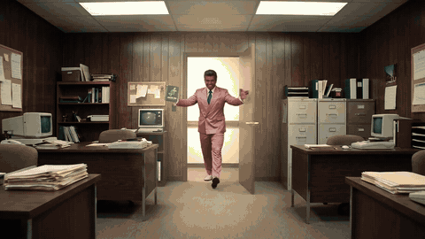
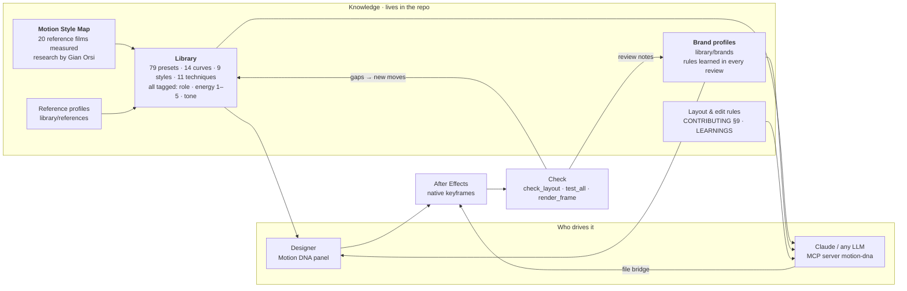
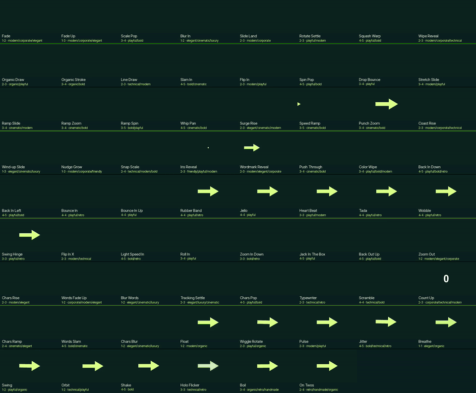
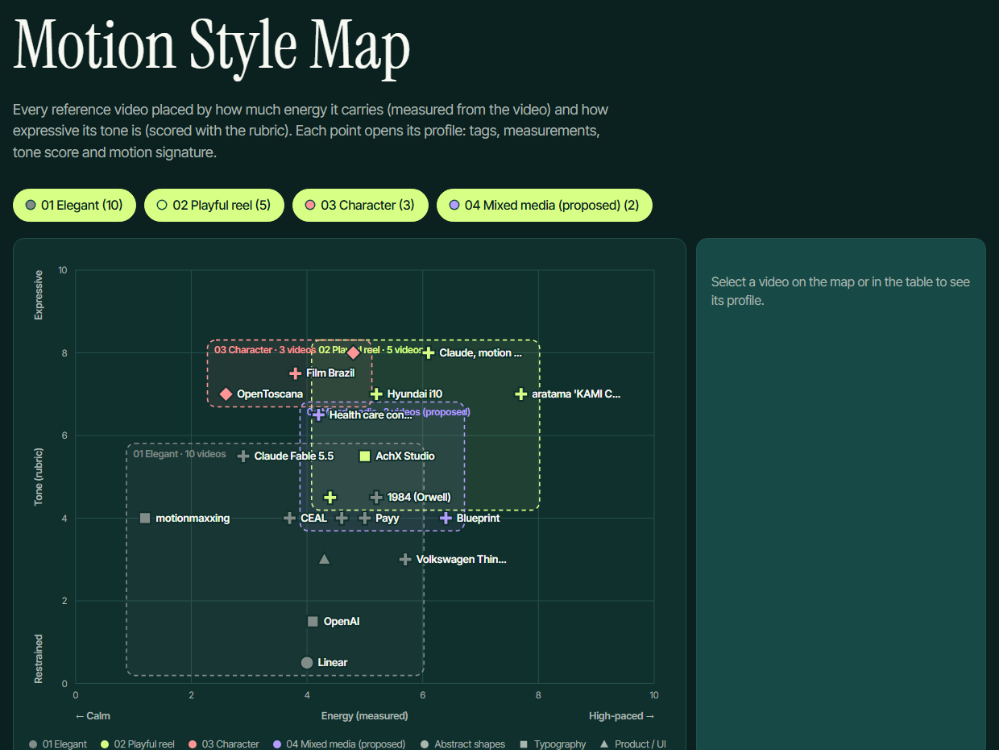
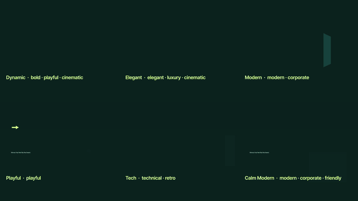
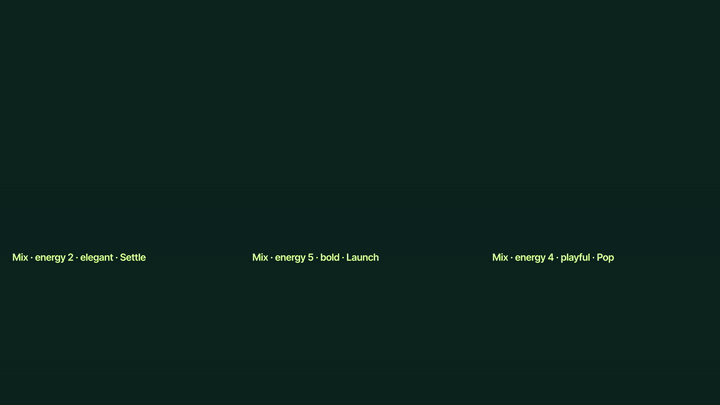
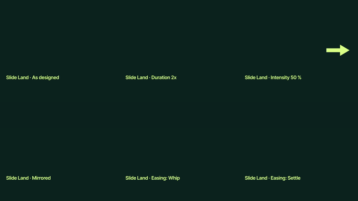

# Motion DNA

Motion made with AI all looks the same: same curves, same moves, same templates. **Motion DNA** gives it an identity.
It is a library of moves, curves, techniques and styles for After Effects, built on measured references, that a
designer applies from a panel or **Claude drives directly inside After Effects** (MCP). Every brand you animate keeps
its own profile that learns from each review. Everything it makes is native keyframes and expressions: nothing extra to render.



*From [the Motion DNA promo](#showcases): tracking, roto, a backlight glow and a freeze title, all built by Claude with the library.*

## How it works



1. **The library** is the vocabulary: moves, token curves (`tokens/`), styles and script techniques, all tagged so they
   can be recombined by feel.
2. **Research feeds it**: reference films and brand analyses are measured and matched against the library; whatever is
   missing is created, tagged and rendered (CONTRIBUTING §8).
3. **Brand profiles remember**: each brand keeps its base style, curve, palette, fonts and the rules learned in its reviews.
4. **Two ways to drive it**: the panel in After Effects, or Claude through the MCP server and a file bridge.
5. **Every piece is checked and feeds back**: the layout QA and the tests catch problems; review notes become brand
   rules, and new needs become new presets.

## What's inside

| Moves | Classics | Text | Loops | Recipes | Styles | Techniques | Curves |
|---|---|---|---|---|---|---|---|
| 31 | 17 | 11 | 11 | 9 | 9 | 11 | 14 + 6 durations |



Full catalog with live thumbnails: **[docs/CATALOG.md](docs/CATALOG.md)** · filterable: `library/index.html` · for LLMs:
`library/INDEX.txt` · tags: `library/tags.json`. All timing comes from the motion tokens: presets ask for `Arrive` +
`Land`, never a raw speed, so the whole library retunes in one place.

## Motion Style Map · research by Gian Orsi



Gian measured **20 reference films** (brand films, launches, explainers, reels) frame by frame and by ear: cuts, share of
time in motion, speed, colour, fitted Bézier curves for every move, and the music (BPM, pulse clarity, cuts on the beat
vs chance, shot length in beats). Each film sits on a map of **measured energy × scored tone**, and every film is broken
into **209 behaviors** named in Motion DNA's own terms (146 map to a preset, 47 are camera, edit or acting craft, 16 were
open gaps). What the library was missing became new pieces:

- **Curves:** `Coast`, `Nudge`, `Wind-up`, `Snap`.
- **Presets measured on real work:** Coast Rise, Wind-up Slide, Nudge Grow, Snap Scale, Iris Reveal, Wordmark Reveal,
  Push Through, Color Wipe, Chars Blur, Boil, On Twos.
- **Styles:** *Editorial*, *Storybook*, *Collage*.
- **How music shapes the edit:** shot length in beats separates styles better than BPM; key moments (logo, reveal) land on
  musical events; the logo pattern "mark first, wordmark slides out from behind it". The Motion DNA promo uses all three.

Explore it: [the map](research/style_map/style_map.html) · [taxonomy](research/style_map/taxonomy.md) ·
[behaviors and mapping](research/ontology/) · [family syntheses, music & edit, cross-family patterns](research/styles/) ·
pipeline in `tools/style_research/`.

## Brand profiles: styles that learn

Every time you animate for a brand and give notes ("labels go into the negative space", "a soft glow, not rays",
"never cut a phrase"), the note is saved as a **rule** in that brand's profile, with why, the project and who said it.
The next piece for that brand, by Claude, another agent or a designer, starts with everything already learned. Brands
are independent: each one refines its own style.

```text
library/brands/<brand>/brand.json   identity (colours, fonts, logo) · feel (energy, tones, base style, curve)
                                    preferred / avoided presets · rules learned in reviews · projects
library/brands/<brand>/thumb.png    its card in the panel
```

- **Panel:** *Brands* shows each brand's card and rules; *In / Out / Both* animates the comp in its style on its curve.
- **Claude (MCP):** `get_brand` before animating, `add_brand_note` for every review note, `apply_brand`, `list_brands`.
- **Terminal:** `python tools/brand.py new acme --name "Acme" --style Modern --curve Coast`,
  `python tools/brand.py note acme "Logos never bounce" --cat motion --why "..."`, `python tools/brand.py show acme`.

Example: [`library/brands/motion-dna`](library/brands/motion-dna/brand.json), the 22 rules learned while making our
own promo. Schema: [`library/brands/_schema.md`](library/brands/_schema.md).

## Rules that keep the work clean

Lessons from real reviews, checked automatically on the built comps by `tools/check_layout.jsx`: no text on text or cards
touching, nothing outside the safe area (labels stack into up to 3 lines instead), at least 32 px, contrast or a card,
nothing on a face, no substituted fonts. Edit rules: never cut a phrase, trim AI shots to their action, music leads the
key moments. All of them: [CONTRIBUTING §9](CONTRIBUTING.md#9-layout-and-edit-rules-every-video-every-comp).

## Get started

**Install** (Windows or macOS): double-click `INSTALL-Windows.cmd` / `INSTALL-macOS.command`, or run `python tools/setup.py`
(Claude does it when you ask it to install Motion DNA). It installs the panel in every After Effects version, the fonts
and the local asset previews, and checks everything. Then restart After Effects, open *Window › Motion DNA.jsx*, and tick
*Preferences › Scripting & Expressions › Allow Scripts to Write Files and Access Network*.
**Update:** `python tools/setup.py --update` (never pulls over local changes) · **remove:** `--uninstall`.


**Designers.** Browse Moves, Classics, Text, Loops, Transitions, Recipes, Styles, Brands, Mix, Techniques and Assets,
filter by energy (1 calm → 5 explosive) and tone, and watch a live preview on the Spark arrow. Tune *Duration*,
*Intensity*, *Direction* and *Easing*, select layers and press **In / Out / Both**; **Remove** cleans it off. With
*Marker timing*, drag the `SS in` / `SS out` markers to retime. Styles and Brands animate a whole comp role by role; Mix
picks moves and curves by tags.

**Claude (MCP).** Open the repo in Claude Code and approve the `motion-dna` server (`.mcp.json`). Claude gets:
browse (`list_presets`, `list_packs`, `list_tags`, `suggest_mix`, `match_reference`, `list_assets`, `list_brands`,
`get_brand`), act in After Effects (`apply_preset`, `apply_pack`, `apply_brand`, `add_asset`, `remove_animation`,
`show_in_panel`), learn (`add_brand_note`), check (`ae_status`, `list_layers`, `render_frame`, `render_comp`) and
`run_jsx`. Without MCP, any LLM reads `library/INDEX.txt` and runs `.jsx` jobs with `bash tools/bridge.sh`.
Contributors and their agents: read [`CLAUDE.md`](CLAUDE.md) and [`CONTRIBUTING.md`](CONTRIBUTING.md).

<br clear="right">

## Showcases

### *Motion DNA · promo* (45 s, 1985 infomercial parody)

Two bored designers in 1985 complain that Claude makes the same animation every time; a salesman bursts in with Motion
DNA. Characters, location and props were designed as sheets first and every shot was generated with them as references
(Nano Banana 2.1 + Seedance 2.5, USD 15.50). The edit was built entirely by Claude with the library: 2D tracked callouts,
a planar-tracked "1985" on the wall, roto (local InSPyReNet mattes), a backlight glow, action lines, a freeze with the
person in colour, a retro app inside a curved CRT, words landing on the voice, music-led timing from the Style Map, and
the layout QA at 0 warnings. Video: [`media/motion_dna_promo/motion_dna_promo.mp4`](media/motion_dna_promo/motion_dna_promo.mp4) ·
story, shot list and costs: [`media/motion_dna_promo/story.md`](media/motion_dna_promo/story.md) · storyboard:
[Figma Slides](https://www.figma.com/slides/z2BSXVNVFhjYOlbBI1ZUy6).

| Tested: styles on one layout | Mix by tags | One move, the panel's controls |
|---|---|---|
|  |  |  |

<details>
<summary>Earlier showcases: the explainer, The 1974 Cypher, The 1974 Boardroom and the first tests</summary>

**Motion DNA · internal explainer** (68 s): how the library was built and how to use it, animated with the library
itself. [`docs/examples/ss_motion_explainer.mp4`](docs/examples/ss_motion_explainer.mp4) ·
[step by step](docs/case-studies/ss-motion-explainer.md). The promotional cut (67 s):
[`docs/examples/ss_motion_promo.mp4`](docs/examples/ss_motion_promo.mp4) · [step by step](docs/case-studies/ss-motion-promo.md).

| Our own curves | The plugin | Claude drives it |
|---|---|---|
|  |  |  |

**The 1974 Cypher** (32 s, speed-ramp test): orbital moves speed-ramped on the beat with the `Ramp` curve, tracked labels
on every detail, and a likeness QA. [`docs/examples/cypher_1974.mp4`](docs/examples/cypher_1974.mp4) ·
[step by step](docs/case-studies/the-1974-cypher.md).

| Ramp on the sneakers | Wide orbit + title | Tracked details |
|---|---|---|
|  |  |  |

**The 1974 Boardroom** (45 s): consistent AI shots, OpenCV tracking, AI roto, organic contours, face scans, titles behind
the people, a holographic HUD, freeze frames with kinetic type, a 70s announcer VO and a roto breakdown.
[`docs/examples/whisky_1974_boardroom.mp4`](docs/examples/whisky_1974_boardroom.mp4) ·
[step by step](docs/case-studies/the-1974-boardroom.md).

| "Zero keyframes." | "Tracked." | "Rotoscoped." |
|---|---|---|
|  |  |  |

| A Figma slide, animated | A draw-on intro | Text tracking on video | HUD on tracked points |
|---|---|---|---|
|  |  |  |  |

People in these earlier showcases are the project collaborators (Aaron Amortegui and Gian Orsi), who agreed to be test
subjects; every clip went through the face refinement pass. Prices, bottlings and roles are fictional.
</details>

## Documentation

- [`docs/CATALOG.md`](docs/CATALOG.md): every preset and style with its thumbnail.
- [`docs/TOOLS.md`](docs/TOOLS.md): every script, what it does and how to run it.
- [`CONTRIBUTING.md`](CONTRIBUTING.md): adding presets, open-source effects, styles, references, case studies; the layout and edit rules (§9).
- [`docs/LEARNINGS.md`](docs/LEARNINGS.md): every pitfall already solved (driving AE from an LLM, ExtendScript, rendering, AI footage, tracking and roto, typography, audio, costs).
- [`CLAUDE.md`](CLAUDE.md): the rules every Claude follows in this repo.

## Credits and requirements

Built by **Aaron Amortegui** and **Gian Orsi** (Motion Style Map research), with Claude. Classics adapt
[animate.css](https://animate.style) **4.1.1** (MIT, © 2020 Daniel Eden) into native keyframes; later releases changed
license and are not used. Fonts: Inter Tight and Instrument Serif (SIL OFL). Animation Composer is used only as a
behavioral reference: its presets are never decrypted, modified or redistributed, and its asset packs are indexed
locally, never committed.

**Requirements:** Windows or macOS · After Effects 2025/2026 · Python 3 (`numpy`, `opencv-python`, `scipy`, `Pillow`) ·
`ffmpeg` · Git LFS · a bash shell (Git Bash on Windows). Clone anywhere: scripts find the repo root on their own.
Platform details and overrides (`SS_AFTERFX`, `SS_AE_APP`, `SS_AERENDER`, `SS_ASSET_PACKS`): [docs/TOOLS.md](docs/TOOLS.md)
and [docs/LEARNINGS.md](docs/LEARNINGS.md).
