# SS Motion Library

Superside's own motion library for After Effects. Designers apply it from a panel; **an LLM (Claude Code or any local model) can drive it on its own**: apply animations, test them, render and grow the catalog. Everything it creates is native keyframes and expressions, with no plugins required.

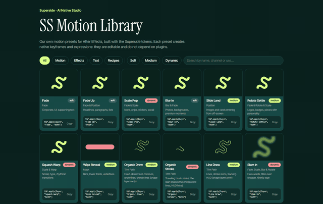

*`library/index.html`: every preset with a live thumbnail, its energy level and the one-line call to apply it.*

## What's inside

> **Latest additions:** a gallery plugin with live previews and **marker-driven timing** (drag *SS in* / *SS out* to retime any preset), **style packs** (Dynamic, Elegant, Modern, Playful, Tech) that animate a whole comp in one click, 17 **Classics** adapted from animate.css 4.1.1 (MIT), speed-ramp curves (`Ramp`, `Surge`, `Whip`), and an **MCP server** so Claude can drive After Effects and the library directly. Every piece we make should leave something new in the library.

<!-- catalog:start -->
**68 presets** in 5 categories, plus style packs. Every one is also listed in `library/INDEX.txt` (for LLMs) and `library/index.html` (for people).

### Motion (23)

Entrances and exits for any layer. `SSP.apply(layer, name, "in" | "out" | "both")`

|   |   |   |   |
|---|---|---|---|
| <br>**Fade** · `soft`<br><sub>Corporate, UI, supporting text</sub> | <br>**Fade Up** · `soft`<br><sub>Headlines, paragraphs, lists</sub> | <br>**Scale Pop** · `dynamic`<br><sub>Icons, chips, stickers, social</sub> | <br>**Blur In** · `soft`<br><sub>Photos, backgrounds, premium moments</sub> |
| <br>**Slide Land** · `medium`<br><sub>Images and cards entering from off-screen</sub> | <br>**Rotate Settle** · `medium`<br><sub>Logos, badges, pieces with personality</sub> | <br>**Squash Warp** · `dynamic`<br><sub>Social, hype, rhythmic transitions</sub> | <br>**Wipe Reveal** · `medium`<br><sub>Bars, lower thirds, underlines</sub> |
| <br>**Organic Draw** · `medium`<br><sub>Hand-drawn feel: contours, underlines, sketch lines (shape layers only)</sub> | <br>**Organic Stroke** · `dynamic`<br><sub>Traveling brush stroke: the start chases the end (accent lines, HUD links)</sub> | <br>**Line Draw** · `medium`<br><sub>Lines, stroke icons, tracking HUD (shape layers only)</sub> | <br>**Slam In** · `dynamic`<br><sub>Hero words, titles over footage, kinetic type</sub> |
| <br>**Flip In** · `medium`<br><sub>Cards, tiles, reveals, before/after</sub> | <br>**Spin Pop** · `dynamic`<br><sub>Badges, stickers, stamps, icons</sub> | <br>**Drop Bounce** · `dynamic`<br><sub>Icons, products, emoji, playful drops</sub> | <br>**Stretch Slide** · `dynamic`<br><sub>Cards, chips, pills, fast UI moves</sub> |
| <br>**Ramp Slide** · `dynamic`<br><sub>Transitions, product slides, bold entrances</sub> | <br>**Ramp Zoom** · `dynamic`<br><sub>Logo reveals, hero products, end cards</sub> | <br>**Ramp Spin** · `dynamic`<br><sub>Icons, badges, logo spins</sub> | <br>**Whip Pan** · `dynamic`<br><sub>Swipe transitions, camera-style moves, carousels</sub> |
| <br>**Surge Rise** · `medium`<br><sub>Headlines, cards, elegant entrances</sub> | <br>**Speed Ramp** · `dynamic`<br><sub>Footage, product shots, action beats, transitions</sub> | <br>**Punch Zoom** · `medium`<br><sub>Footage, precomps, freeze frames, cut emphasis</sub> |   |

### Classics (17)

Effects adapted from animate.css 4.1.1 (MIT) into native keyframes: entrances, exits and attention moves. Same call as Motion.

|   |   |   |   |
|---|---|---|---|
| <br>**Back In Down** · `dynamic`<br><sub>Cards, product shots, bold drops (enter)</sub> | <br>**Back In Left** · `dynamic`<br><sub>Slides, lower thirds, carousels (enter)</sub> | <br>**Bounce In** · `dynamic`<br><sub>Icons, badges, buttons, emoji (enter)</sub> | <br>**Bounce In Up** · `dynamic`<br><sub>Notifications, stickers, playful entrances (enter)</sub> |
| <br>**Rubber Band** · `dynamic`<br><sub>CTAs, logos, a beat accent (attention)</sub> | 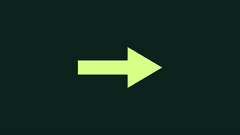<br>**Jello** · `dynamic`<br><sub>Playful accents, stickers (attention)</sub> | 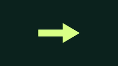<br>**Heart Beat** · `medium`<br><sub>Likes, prices, a pulse on the beat (attention)</sub> | 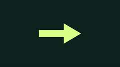<br>**Tada** · `dynamic`<br><sub>Reveals, wins, offers (attention)</sub> |
| 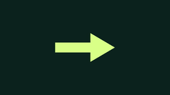<br>**Wobble** · `dynamic`<br><sub>Errors, jokes, quirky accents (attention)</sub> | <br>**Swing Hinge** · `medium`<br><sub>Signs, tags, hanging elements (attention)</sub> | <br>**Flip In X** · `medium`<br><sub>Cards, tiles, scoreboard flips (enter)</sub> | <br>**Light Speed In** · `dynamic`<br><sub>Speed, sport, fast lower thirds (enter)</sub> |
| <br>**Roll In** · `dynamic`<br><sub>Wheels, coins, round icons (enter)</sub> | <br>**Zoom In Down** · `medium`<br><sub>Titles that drop in from above (enter)</sub> | <br>**Jack In The Box** · `dynamic`<br><sub>Surprises, reveals, kids and playful brands (enter)</sub> | <br>**Back Out Up** · `dynamic`<br><sub>Exits upward, cards leaving (exit)</sub> |
| <br>**Zoom Out** · `soft`<br><sub>Quiet exits, scene changes (exit)</sub> |   |   |   |

### Text (10)

Per character or per word, on text layers. `SSP.applyText(layer, name, "in" | "out" | "both")`

|   |   |   |   |
|---|---|---|---|
| <br>**Chars Rise** · `medium`<br><sub>Short headlines, names, kickers</sub> | <br>**Words Fade Up** · `soft`<br><sub>Phrases, captions, quotes</sub> | <br>**Blur Words** · `soft`<br><sub>Premium moments, calm intros</sub> | <br>**Tracking Settle** · `medium`<br><sub>All-caps titles, typographic logos</sub> |
| <br>**Chars Pop** · `dynamic`<br><sub>Social, hype, big numbers</sub> | <br>**Typewriter** · `medium`<br><sub>Captions, terminals, UI, quotes</sub> | <br>**Scramble** · `dynamic`<br><sub>Tech, data, HUD labels, reveals</sub> | 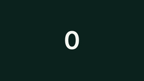<br>**Count Up** · `medium`<br><sub>Stats, KPIs, prices, counters</sub> |
| <br>**Chars Ramp** · `medium`<br><sub>Titles that build tension, trailers, reveals</sub> | <br>**Words Slam** · `dynamic`<br><sub>Punchy statements, social hooks, VO beats</sub> |   |   |

### Effects (9)

Continuous loops driven by expressions. `SSP.applyFx(layer, name)`

|   |   |   |   |
|---|---|---|---|
| 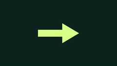<br>**Float** · `soft`<br><sub>Idle icons and cards, living backgrounds</sub> | 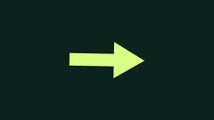<br>**Wiggle Rotate** · `medium`<br><sub>Stickers, illustrations with personality</sub> | 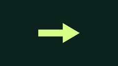<br>**Pulse** · `medium`<br><sub>CTAs, buttons, attention grabbers</sub> | 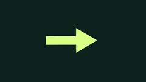<br>**Jitter** · `dynamic`<br><sub>Social, glitch, high-energy pieces</sub> |
| 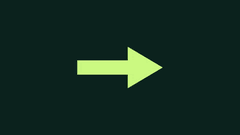<br>**Breathe** · `soft`<br><sub>Ambient glows, background shapes, calm idle states</sub> | <br>**Swing** · `soft`<br><sub>Hanging tags, badges, signs, pendulums</sub> | <br>**Orbit** · `soft`<br><sub>Dots and satellites around a logo, decorative loops</sub> | <br>**Shake** · `dynamic`<br><sub>Impacts, bass hits, alarms, energetic footage</sub> |
| 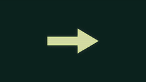<br>**Holo Flicker** · `medium`<br><sub>HUD labels, tech overlays, holographic UI</sub> |   |   |   |

### Recipes (9)

Behavior measured from reference animations and rebuilt with our own keyframes. `SSP.applyRecipe(layer, id, "both")`

|   |   |   |   |
|---|---|---|---|
| 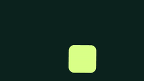<br>**W3L** · `dynamic`<br><sub>position & rotation & scale · loop</sub> | <br>**4LC** · `dynamic`<br><sub>position & rotation · transition</sub> | 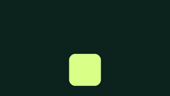<br>**D2T** · `dynamic`<br><sub>position · loop</sub> | 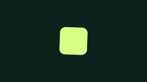<br>**2JK** · `medium`<br><sub>rotation · loop</sub> |
| <br>**1DF+UNU** · `dynamic`<br><sub>scale · loop</sub> | <br>**X9R** · `medium`<br><sub>opacity & scale · transition</sub> | <br>**PE6** · `medium`<br><sub>position · transition</sub> | <br>**4VW** · `dynamic`<br><sub>position & scale · transition</sub> |
| 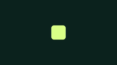<br>**2JV** · `dynamic`<br><sub>scale · transition</sub> |   |   |   |

### Packs (5)

One click gives a whole comp an identity: each layer gets the preset of its role (title, subtitle, body, shape, media, logo), staggered. `SSP.applyPack(comp, name)`

|   |   |   |   |
|---|---|---|---|
| 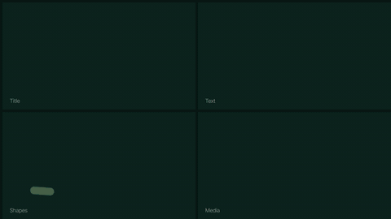<br>**Dynamic** · `dynamic`<br><sub>Social, launches, hype: fast slams, whips and speed ramps.</sub> | <br>**Elegant** · `soft`<br><sub>Premium, fashion, hospitality: slow blurs, soft rises, generous timing.</sub> | <br>**Modern** · `medium`<br><sub>Corporate, SaaS, product: clean rises and slides on the brand curves.</sub> | <br>**Playful** · `dynamic`<br><sub>Kids, food, consumer apps: bounces, wobbles and jack-in-the-box reveals.</sub> |
| 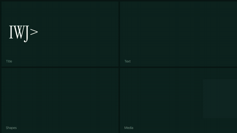<br>**Tech** · `medium`<br><sub>Data, AI, fintech, HUDs: decoding text, line draws and holographic flicker.</sub> |   |   |   |
<!-- catalog:end -->

### Pick by energy

Every preset has an **energy** level, so you can choose by the tone of the piece:

| Energy | Use it for | Examples |
|---|---|---|
| `soft` | Corporate, UI, premium, calm | Fade, Blur In, Words Fade Up, Float, Breathe, Swing, Orbit |
| `medium` | Most brand work | Surge Rise, Chars Ramp, Slide Land, Flip In, Organic Draw, Punch Zoom, Chars Rise, Typewriter, Count Up, Pulse, Holo Flicker |
| `dynamic` | Social, hype, launches | Ramp Slide, Ramp Zoom, Whip Pan, Speed Ramp, Scale Pop, Slam In, Spin Pop, Drop Bounce, Stretch Slide, Words Slam, Scramble, Chars Pop, Jitter, Shake |

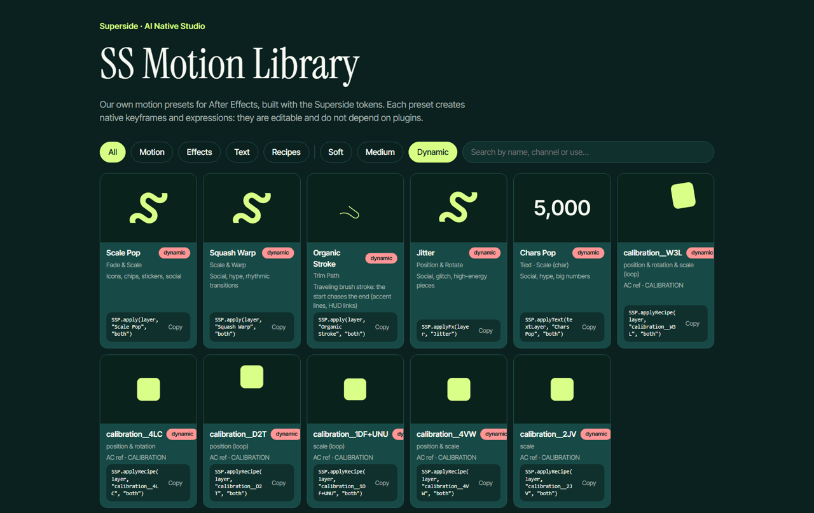

*The visualizer filtered to `dynamic`. Filters can be linked: `index.html?kind=text&energy=soft`.*

## The library in use

Real pieces animated only with library presets and tokens, with no hand-set keyframes:

| A Figma slide, animated | The S-mark intro |
|---|---|
|  |  |
| The *Essentials* slide rebuilt in AE: title `Arrive` + `Land`, image cards `Stage` + `Land` with a stagger, chips scaling in one by one, the coral chip with `Pop` | Outline draws on (`Sweep` + `Cruise`), fill lands with `Pop`, tagline `Arrive` + `Land`, chained `Launch` exit |
| **Motion presets side by side** | **Effects running as loops** |
| 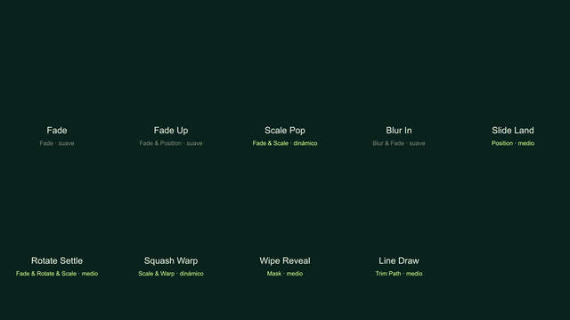 |  |
| Same element, different presets: compare timing and energy at a glance | `Float`, `Wiggle Rotate`, `Pulse`, `Jitter` on the same shape |
| **Text and tracking on video** | **Holographic HUD on tracked points** |
| 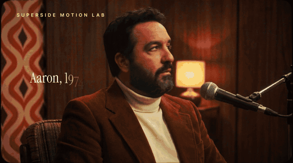 |  |
| `Chars Rise`, `Tracking Settle` and callouts pinned to points tracked with OpenCV | `SSHUD` brackets, callouts, meter and chip, all animated with library presets |

## How it works

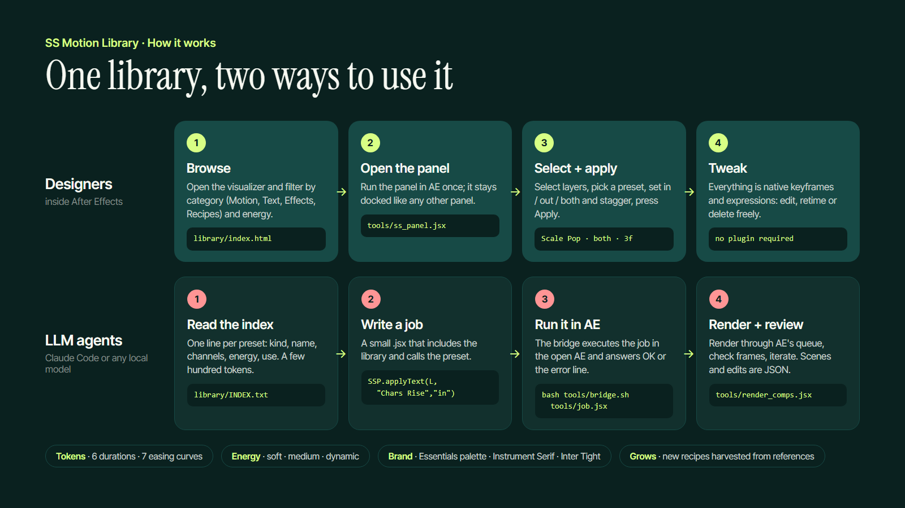

All timing comes from the Superside motion tokens: **6 durations** and **10 easing curves**, including three speed-ramp curves (`Ramp`, `Surge`, `Whip`: slow → burst of speed → slow) (`tokens/superside_motion_tokens.json`). Presets never hard-code a speed: they ask for `Arrive` + `Land`, so the whole library stays consistent and can be retuned in one place.

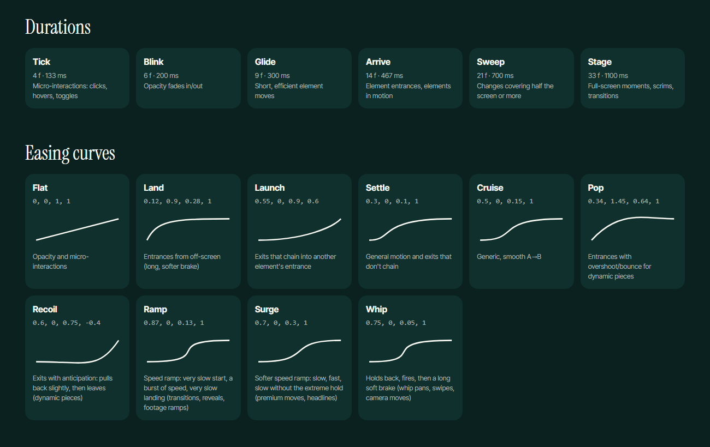

## How to use it

### Designers (in After Effects)

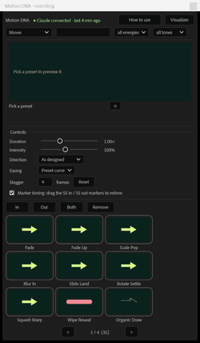

1. Install the brand fonts from `assets/fonts/` (right-click › Install).
2. **Install the panel once** (Window menu, dockable, every AE version on the machine):
   ```bash
   powershell -ExecutionPolicy Bypass -File tools/install_panel.ps1    # Windows
   bash tools/install_panel.sh                                         # macOS
   ```
   Restart AE, open *Window › SS Motion.jsx* and dock it. It reads the library straight from this repo clone, so a `git pull` brings the new presets. Enable *Edit › Preferences › Scripting & Expressions › Allow Scripts to Write Files and Access Network*.
3. **Browse the gallery** by category (Motion, Classics, Text, Effects, Recipes, Packs, Assets) with search and an energy filter. Clicking a thumbnail plays a **live preview**: the preset's real curve, sampled into `library/preview_curves.json` (ScriptUI cannot play GIFs, so the panel redraws the motion as vectors, ~90 KB for the whole library).
4. **Select layers → In, Out or Both.** Stagger in frames for several layers.
5. **Retime with markers:** with *Marker timing* on, each layer gets an `SS in` marker (where the entrance ends) and an `SS out` marker (where the exit starts). Drag them and the animation stretches or compresses with the same curve, no keyframe editing.
6. **Packs:** pick a pack and press In/Both. Every layer gets the preset of its role (title, subtitle, body, shape, media, logo) with the pack's rhythm. Backgrounds, nulls and locked layers are left alone.
7. **Assets:** drop local sound effects and overlays at the playhead.

<br clear="right">

### LLM agents (Claude Code or any MCP client)

**MCP server (recommended).** The repo ships a dependency-free MCP server (`tools/mcp/ss_motion_mcp.py`, registered in `.mcp.json`). Open the repo in Claude Code, approve the `ss-motion` server, and Claude gets these tools:
- **Browse (no AE needed):** `list_presets`, `list_packs`, `list_assets`.
- **Inspect AE:** `ae_status`, `list_layers`.
- **Act:** `apply_preset` (in/out/both, stagger, marker timing), `apply_pack`, `add_asset`, `show_in_panel`.
- **Check:** `render_frame` (to look at the result), `render_comp`.
- **Escape hatch:** `run_jsx`.

It talks to AE through the file bridge, which starts by itself when the SS Motion panel loads (dock it once).

**Without MCP**, any LLM can do the same with plain files:
1. **Read `library/INDEX.txt`**: one line per preset (`kind|name|channels|energy|use`) plus the calls, tokens, packs and tools.
2. **Write a job** in `tools/`:
   ```js
   #include "ss_presets.jsx"
   (function () {
       var L = app.project.activeItem.layer("Title");
       SSP.markerTiming(true);                       // optional: SS in / SS out markers
       SSP.applyText(L, "Chars Rise", "both");      // SSP.apply · applyText · applyFx · applyRecipe · applyPack
       return "ok";
   })();
   ```
3. **Run it:** `bash tools/bridge.sh tools/my_job.jsx` (answers `OK` or `ERROR` with the line number).
4. **Render and review** with `tools/render_comps.jsx` + `tools/wait_files.sh`, or `comp.saveFrameToPng` for single frames.

Bigger pieces are data, not code: scenes (`tools/build_scene.jsx`) and edits (`tools/build_edit.jsx`) are JSON. Contributors and their agents: read [`CLAUDE.md`](CLAUDE.md) and [`CONTRIBUTING.md`](CONTRIBUTING.md).

## Tools

| Tool | What it does |
|---|---|
| `tools/ss_motion_lib.jsx` (`SSM`) | Token-driven keyframes: `animate`, `pop`, `recoil`, `animateBezier`, `animateStops`, `organicStops` (hand-drawn rhythm), `font(role)` |
| `tools/ss_presets.jsx` (`SSP`) | The presets: `apply`, `applyFx`, `applyText`, `applyRecipe` |
| `tools/ss_panel.jsx` + `tools/install_panel.ps1` | Gallery panel (Window menu, dockable): categories, live vector previews, In/Out/Both, marker timing, packs, assets |
| `tools/mcp/ss_motion_mcp.py` (`.mcp.json`) | MCP server: Claude browses the library and drives AE (apply presets and packs, add assets, render frames) |
| `tools/sample_previews.jsx` · `tools/make_panel_thumbs.sh` · `tools/pack_demos.jsx` | Panel previews (sampled curves), panel thumbnails, pack demo renders |
| `tools/bridge.sh` + `tools/ss_bridge.jsx` | Runs `.jsx` jobs in the open AE from the terminal |
| `tools/ss_hud.jsx` (`SSHUD`) | Holographic overlays on tracked points: bracket, callout, meter, chip, contour, face scan, floating panel |
| `tools/track_points.py` | OpenCV point tracker → JSON for AE nulls (`--regions regions.json`) |
| `tools/matte_contours.py` | Per-frame subject contours from an AI matte (`--subjects`, `--split-x`) |
| `tools/build_scene.jsx` | Scene from JSON: plate, tracking, matte, text behind people, HUD |
| `tools/build_edit.jsx` | Edit from JSON: cuts, **speed ramps** (`speed`), freeze frames with kinetic type, titles (`texts`), VO, music ducking, SFX, end card |
| `tools/build_breakdown.jsx` | 2×2 roto breakdown (plate · matte · contours · composite) |
| `tools/face_check.py` | Likeness QA: real photo next to every face found in AI stills or clips |
| `tools/build_explainer.jsx` | Slides/explainer scenes from a JSON storyboard (Figma coordinates), every element animated by a preset |
| `tools/build_app_screen.jsx` | Browser-window recording of the visualizer, rebuilt from screenshots |
| `tools/render_comps.jsx` | Renders comps through the open AE's render queue |
| `tools/ss_assets.jsx` (`SSA`) + `tools/index_assets.py` | Local asset packs: index SFX/overlays by category and loudness, place them by name |

## Growing the library

New presets come from measuring reference animations, never from copying them. With Animation Composer as the reference:

1. **AE:** *File › Scripts › Run Script File…* → `tools/ss_harvest_station.jsx`. Pick the section and press **Start**.
2. **Animation Composer panel:** open the same folder.
3. **Driver** (first time only: `python tools/ac_driver.py calibrate`, pressing F8 over three thumbnails; then `preview` to check):
   ```bash
   python tools/ac_driver.py run
   ```
   It double-clicks thumbnail after thumbnail, waits for the station to log each preset (curves, channels and name), scrolls, and stops on its own. ESC aborts.
4. **Merge into the library** (name OCR → recipes → thumbnails → index):
   ```bash
   bash tools/expand_library.sh
   ```

Recipes store *what moves and how* (relative channels, frames, curve or frequency/amplitude), and `SSP.applyRecipe` reproduces them with our own keyframes. When a measured curve matches a token, the token is used.

> Animation Composer is licensed software by Mister Horse. It has no scripting API and its presets are encrypted: **we never decrypt or modify it**, we only automate its UI and observe the result. Harvests (`research/harvest/`) are internal behavioral references; no presets or plugin renders are redistributed.

## Asset packs (sound effects and overlays)

The motion presets are ours and live in this repo. Sound effects and footage overlays come from the asset packs installed with Animation Composer (≈300 files on our machines: whooshes, UI blips, impacts, glitches, sparkles, light leaks, grain, film burns, VHS, glitch masks). Those files are licensed, so **they are never copied into the repo**: each machine indexes its own packs and the library places them by name.

```bash
python tools/index_assets.py      # → library/ASSETS.local.txt (git-ignored): category, length and loudness of every asset
```
```js
#include "ss_assets.jsx"
SSA.sfx(comp, "Swoosh Wood 01_Variant Main", 1.2, -9);       // name, time, gain dB [, max length]
SSA.overlay(comp, "Light Leak B1 10", 0);                   // blend picked by family: leaks → Screen, grain → Overlay
```

The index measures each sound's loudness and flags the harsh ones (`loud`) and the long ones (`long`), so an LLM picks a soft blip for UI and trims a boom instead of guessing.

## Credits

- **Classics** adapt the keyframes of [animate.css](https://animate.style) **4.1.1** (MIT License, © 2020 Daniel Eden / Animate.css) into native After Effects keyframes (`library/css_presets.json`). Later animate.css releases use the Hippocratic License and are not used.
- Fonts: Inter Tight and Instrument Serif (SIL Open Font License).

## Structure

| Folder | Contents |
|---|---|
| `tokens/` | Timing, curves and font roles |
| `library/` | `INDEX.txt` (LLM), `library.json`, `recipes.json`, `index.html`, `gifs/`, `posters/` |
| `tools/` | JSX library, panel, bridge, HUD, scene/edit builders, harvest station, AC driver, render pipelines |
| `assets/` | Superside logos, S-mark shape for AE, palette and components from the *Essentials* Figma, brand fonts |
| `docs/` | `LEARNINGS.md`, case studies, screens and examples |
| `ae/` | Test project |
| `media/` | AI test footage, mattes, tracking data, music and VO for the showcases |
| `research/` | Calibration, harvests, preview catalog |

## Requirements

**Windows or macOS** · After Effects 2025/2026 · Python 3 with `numpy`, `opencv-python`, `scipy`, `Pillow` · `ffmpeg` on the PATH · Git LFS · a bash shell (Git Bash on Windows; built in on macOS).
The repo can be cloned anywhere: scripts compute the repo root (`SS_ROOT`) from their own location. Run the `.jsx` files from `tools/` (don't copy them into AE's *ScriptUI Panels* folder; the installers add a small loader instead).

| | Windows | macOS |
|---|---|---|
| Install the panel | `tools/install_panel.ps1` | `tools/install_panel.sh` |
| Bridge / MCP start AE scripts with | `AfterFX.exe -s` | `osascript` → AE's `DoScriptFile` |
| Overrides | `SS_AFTERFX`, `SS_AERENDER` | `SS_AE_APP` (e.g. `Adobe After Effects 2026`), `SS_AERENDER` |
| Local asset packs | `%LOCALAPPDATA%\MisterHorse\ProductManager\AssetPacks` | `~/Library/Application Support/MisterHorse/ProductManager/AssetPacks` (override: `SS_ASSET_PACKS`) |
| Animation Composer harvesting (`ac_driver.py`, label OCR) | yes | not available (Windows UI automation and OCR) |

On macOS, the first `osascript` call asks for permission to control After Effects (System Settings › Privacy & Security › Automation): allow it for your terminal. The macOS path is written to mirror the tested Windows one but has not been run on a Mac yet; report anything that breaks.

## Notes

- If a project contains Animation Composer layers, `aerender` hangs: render through `tools/render_comps.jsx` / `tools/render_queue.jsx` (the open AE's queue). AE shows "Not Responding" while a scripted render runs; that is expected.
- Brand fonts (Inter Tight and Instrument Serif, OFL) are picked with `SSM.font("display" | "ui" | "ui_regular")`, falling back to Georgia/Arial.
- Rebuilding a scene comp removes it from every comp that nests it; `build_scene.jsx` rebuilds the breakdown automatically, and `build_edit.jsx` should run after it.

## Documentation

- [`docs/LEARNINGS.md`](docs/LEARNINGS.md) — everything we learned: driving AE from an LLM, ExtendScript pitfalls, rendering, AI footage with Flora, tracking/roto/overlays, typography, audio, repo hygiene and costs.
- [`docs/case-studies/the-1974-cypher.md`](docs/case-studies/the-1974-cypher.md) — speed ramps and likeness QA, step by step.
- [`docs/case-studies/the-1974-boardroom.md`](docs/case-studies/the-1974-boardroom.md) — the Boardroom showcase, step by step, with prompts.

---

## Tests and showcases

### *SS Motion Library · internal explainer* (68 s)

How we built the library, why it exists (AI-made motion all looks the same) and how to use it, animated **with the library itself**. Storyboard in Figma ([slack_video › motion pluguin](https://www.figma.com/design/OGiHZakKWL9iUXUJ8rn7Ko/slack_video?node-id=70-2)), scenes built from JSON by `tools/build_explainer.jsx`. Video: [`docs/examples/ss_motion_explainer.mp4`](docs/examples/ss_motion_explainer.mp4) · step by step: [`docs/case-studies/ss-motion-explainer.md`](docs/case-studies/ss-motion-explainer.md).

| Our own curves | The plugin | Claude drives it |
|---|---|---|
|  |  |  |

### *The 1974 Cypher* (32 s · speed-ramp test)

The two collaborators as a 1970s Bronx crew, back to back. Orbital moves around the outfit details are speed-ramped on the beat with the new `Ramp` curve (slow-mo → burst → slow-mo, a rewind whip on the last beat), with tracked labels on every detail. It also tested likeness: real photos only as identity references, a face-check sheet before spending on video, and an A/B of Seedance 2.5 vs MiniMax H3 Max. Full video: [`docs/examples/cypher_1974.mp4`](docs/examples/cypher_1974.mp4) · step by step: [`docs/case-studies/the-1974-cypher.md`](docs/case-studies/the-1974-cypher.md).

| Ramp on the sneakers | Wide orbit + title | Tracked details |
|---|---|---|
| 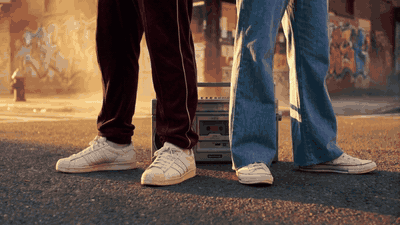 | 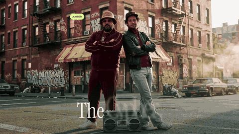 |  |

### *The 1974 Boardroom* (45 s)

A capability test built end to end by Claude with this repo, to show the team what the library can do: three consistent AI shots of the two project collaborators (Flora: Nano Banana Pro + Kling 3.0 Pro), OpenCV tracking, AI roto mattes (VEED), organic hand-drawn contours, face scans, titles behind the people, a holographic HUD built from library presets, **freeze frames with kinetic type**, a 70s announcer voiceover (ElevenLabs v3), a soul-funk score ducked under the VO, a roto breakdown, and the library app itself. Full video: [`docs/examples/whisky_1974_boardroom.mp4`](docs/examples/whisky_1974_boardroom.mp4).

| "Zero keyframes." | "Tracked." | "Rotoscoped." |
|---|---|---|
|  |  |  |

| The library, in the office | Roto breakdown |
|---|---|
|  |  |

| Shot 1 · two-shot | Shot 2 · subject 01 | Shot 3 · subject 02 |
|---|---|---|
|  |  |  |

Everything is data-driven: `media/whisky/scenes.json` (shots, app screen, breakdown) and `media/whisky/edit.json` (cut, freezes, VO, music, SFX, end card):

```bash
bash tools/bridge.sh tools/build_scene.jsx     # scenes + app screen + breakdown
bash tools/bridge.sh tools/build_edit.jsx      # the edit
```

### Earlier tests

| Text behind the subject |
|---|
| 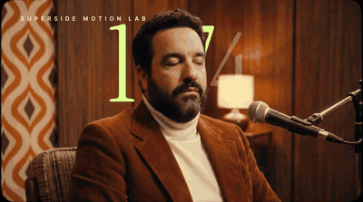 |
| Giant title between background and person, using an AI person matte |

Test comps in `ae/motion_lab_v01.aep`: `01_SS_Icon_Intro` (S-mark draw-on), `02_Track_70s` (tracked points and callout), `03_Figma_Chips` (*Essentials* slide with tokens), `04_Text_Tracking_70s`, `05_Text_Behind_70s`, `HUD_TEST`, and the `WHISKY 1974` folder.

People in `media/` and the showcases are project collaborators (Aaron Amortegui and Gian Orsi) who agreed to be used as test subjects. Prices, bottlings and roles are fictional.
