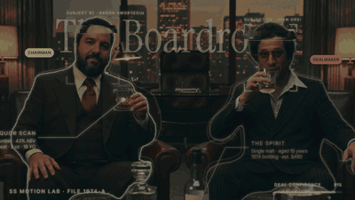
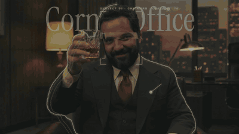
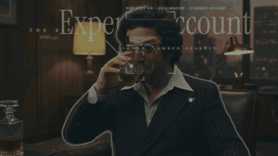

# SS Motion Library

Superside's own motion library for After Effects, built so that **an LLM (Claude or any other) can use it locally to drive AE**: apply animations, test them, render, and grow the catalog. Everything it creates is native keyframes and expressions, with no plugins required.

## What it looks like

240 px thumbnails (the full catalog lives in `library/index.html`).

| Category | Example | Example | Good for |
|---|---|---|---|
| **Motion** — entrances and exits |  `Scale Pop` |  `Line Draw` | Icons, chips, cards, lines |
| **Effects** — continuous loops |  `Float` |  `Jitter` | Idle elements, high-energy pieces |
| **Text** — per character or word |  `Chars Rise` |  `Tracking Settle` | Headlines, kickers, captions |
| **Recipes** — behavior harvested from Animation Composer and reproduced with our own code |  `2JV` bouncy pop |  `4VW` bouncy drop | Growing the catalog from real references |

Every preset has an **energy** level (`soft`, `medium`, `dynamic`) to match the piece: social/hype → dynamic, corporate/UI → soft.

## Showcase: *The 1974 Boardroom*

A 36 s capability test built end to end by Claude with this repo: three consistent AI shots of two project collaborators (Flora: Nano Banana Pro + Kling 3.0 Pro), OpenCV tracking, AI roto mattes (VEED), organic hand-drawn contours, face-scan slices, giant titles behind the people, a holographic HUD from library presets and the *Essentials* Figma palette, **freeze frames with foreground titles**, a tongue-in-cheek **70s announcer voiceover** (ElevenLabs v3), a soul-funk score (ElevenLabs Music) auto-ducked under the VO, Animation Composer UI sounds and a roto breakdown. Full video: [`docs/examples/whisky_1974_boardroom.mp4`](docs/examples/whisky_1974_boardroom.mp4) · step-by-step: [`docs/case-studies/the-1974-boardroom.md`](docs/case-studies/the-1974-boardroom.md).

| Freeze · "Zero emails." | Freeze · "The Chairman." | Freeze · "The Dealmaker." |
|---|---|---|
|  |  |  |

| Shot 1 · two-shot | Shot 2 · subject 01 | Shot 3 · subject 02 | Roto breakdown |
|---|---|---|---|
|  |  |  |  |
| Title behind the people, organic contours, face scans, liquor tracking, the spirit (fictional price), name cards, deal meter | "Corner Office" behind him, liquor bracket on the rising glass, outfit, build scan, style index | "Expense Account" behind him, the sip, outfit, bar service, charisma | Plate → roto matte → contours → composite |

Everything is data-driven: `media/whisky/scenes.json` (shots + breakdown) and `media/whisky/edit.json` (cut, freezes, VO, music, SFX, end card). Rebuild with `tools/build_scene.jsx`, `tools/build_breakdown.jsx` and `tools/build_edit.jsx` through `tools/bridge.sh`.

More tests on the same pipeline:

| Text + tracking | Text behind the subject | HUD module |
|---|---|---|
|  |  |  |
| Title on the wallpaper (parallax), label on the face, ON AIR on the mic | Giant title between background and person (Flora/VEED matte) | Scan bracket, callouts, meter and chip on tracked points |

## How it works

```
tokens (timing + curves) ──► ss_motion_lib.jsx (SSM.animate) ──► ss_presets.jsx (SSP.apply / applyFx / applyText / applyRecipe)
                                                                        │
            LLM ──► bridge/inbox/*.jsx ──► AE (ss_bridge.jsx) ──► bridge/outbox/*.txt   (apply, test, render)
                                                                        │
                                       library/INDEX.txt  ◄── the only file the LLM reads (~1 line per preset)
```

- **`tokens/superside_motion_tokens.json`**: 6 durations (Tick 4f … Stage 33f), 7 easing curves (Flat, Land, Launch, Settle, Cruise, Pop, Recoil) calibrated against real transitions, and font roles.
- **`library/INDEX.txt`**: ultra-compact index `kind|name|channels|energy|use`. An LLM reads it whole for very few tokens; the HTML and GIFs are for humans only.

## For the LLM (Claude Code)

The skill in `.claude/skills/ss-motion-library` explains everything. The essentials:

```bash
bash tools/bridge.sh tools/<job>.jsx      # runs a .jsx in AE and returns OK/ERROR with the line number (starts the bridge if needed)
```
```js
#include "ss_presets.jsx"   // keep the job inside tools/ (or use the path to tools/ss_presets.jsx)
(function () {
    var L = app.project.activeItem.layer("Title");
    SSP.applyText(L, "Chars Rise", "both");
    return "ok";
})();
```

## HUD, scenes and edits

- **`tools/ss_hud.jsx`** — holographic overlay components that follow tracked nulls: `SSHUD.bracket` (scan corners + sweeping line + label), `SSHUD.callout` (dot, elbow line that draws on, title + body text), `SSHUD.meter` (counting percentage bar), `SSHUD.chip` (Figma pill), `SSHUD.contour` (organic animated contour lines from a matte) and `SSHUD.faceScan` (sweeping slice + holographic edges of the face). Glow, scanlines and a subtle flicker give the holographic look; motion comes from the library presets.
- **`tools/matte_contours.py`** — per-frame subject contours from an alpha matte (`--subjects`, `--split-x` for touching people).
- **`tools/build_breakdown.jsx`** — 2×2 roto breakdown (plate · matte · contours · composite).
- **`tools/track_points.py`** — OpenCV KLT tracker: `python tools/track_points.py clip.mp4 tracks.json --regions regions.json --debug debug.mp4` (regions = `{"name": [x, y, radius]}`).
- **`tools/build_scene.jsx`** — builds comps from a JSON spec: plate + tracking nulls + optional people `matte` + items (`behind` text, `contour`, `faceScan`, `bracket`, `callout`, `meter`, `chip`, `title`, `kicker`; optional `t1` to fade an item out before it leaves the frame). Layer order: plate · behind text · matte · grain · contours · face scans · HUD.
- **`tools/build_edit.jsx`** — sequences scene comps with optional **freeze frames** (time remap hold + punch-in + scrim + foreground title + organic underline + click/pop SFX), places **VO** and SFX in each shot's own time (freezes shift them automatically), **ducks the music under the VO**, and adds a branded end card.
- **Organic strokes** — `Organic Draw` / `Organic Stroke` presets: uneven keyframe spacing (3–5 seeded segments, varied speeds, micro-holds) so lines accelerate, brake and pause like a hand drawing. `SSM.animateStops` / `SSM.organicStops` are reusable for any property.

## Growing the library with Animation Composer (without touching the plugin)

Animation Composer has no scripting API and its presets are encrypted: **we never decrypt or modify it**. Instead we automate its UI, the way a person would, and observe the result.

1. **AE:** *File › Scripts › Run Script File…* → `tools/ss_harvest_station.jsx`. Pick the section and press **Start**.
2. **Animation Composer panel:** open the same folder.
3. **Driver** (first time only: `python tools/ac_driver.py calibrate`, pressing F8 over three thumbnails; then `preview` to check):
   ```bash
   python tools/ac_driver.py run
   ```
   It double-clicks thumbnail after thumbnail, waits for the station to log each preset (recipe, curves and name), scrolls, and stops on its own. ESC aborts.
4. **Merge into the library** (name OCR → recipes → thumbnails → index):
   ```bash
   bash tools/expand_library.sh
   ```

Recipes store *what moves and how* (relative channels, frames, curve or frequency/amplitude), and `SSP.applyRecipe` reproduces them with our own keyframes. When a measured curve matches a token, the token is used.

> Animation Composer is licensed software by Mister Horse. Harvests (`research/harvest/`) are internal behavioral references; no presets or plugin renders are redistributed.

## For designers

- **Panel:** `tools/ss_panel.jsx` → select layers → pick a preset → Apply (tabs: Motion, Text, Effects, Recipes; energy filter; stagger).
- **Visualizer:** `library/index.html`.

## Test comps (`ae/motion_lab_v01.aep`, all on an AI-generated video)

| Comp | What it tests |
|---|---|
| `01_SS_Icon_Intro` | Superside S-mark: line draw-on, Pop fill, Launch exit |
| `02_Track_70s` | 6 OpenCV-tracked points, constellation lines, tracked callout, Animation Composer grain/light leak |
| `03_Figma_Chips` | The *Essentials* Figma slide animated with tokens (staggered chips) |
| `04_Text_Tracking_70s` | Text presets, fixed and tracked to the scene (title on the wallpaper, label on the face, ON AIR on the mic) |
| `05_Text_Behind_70s` | Giant title between the background and the person, using a person matte from Flora (VEED) |
| `HUD_TEST` | The HUD module on the 70s clip (`tools/hud_demo.jsx`) |
| `WHISKY_01..03`, `WHISKY_BREAKDOWN`, `WHISKY_EDIT` | *The 1974 Boardroom* showcase (folder `WHISKY 1974`) |

## Documentation

- [`docs/LEARNINGS.md`](docs/LEARNINGS.md) — everything we learned: driving AE from an LLM, ExtendScript pitfalls, rendering, Animation Composer architecture, AI footage with Flora, tracking/roto/overlays, layout, audio, repo hygiene and costs.
- [`docs/case-studies/the-1974-boardroom.md`](docs/case-studies/the-1974-boardroom.md) — the full showcase, step by step, with prompts.

## Structure

| Folder | Contents |
|---|---|
| `tokens/` | Timing, curves and font roles |
| `tools/` | JSX library, panel, bridge, harvest station, AC driver, pipelines (`expand_library.sh`, `render_gifs.sh`, `render_queue.jsx`, `render_comps.jsx`) |
| `library/` | `INDEX.txt` (LLM), `library.json`, `recipes.json`, `index.html`, `gifs/` |
| `assets/` | Superside logos, S-mark shape for AE, palette and components from the *Essentials* Figma, brand fonts |
| `ae/` | Test project (see above) |
| `media/` | Base video (Flora, 70s 16mm look), person matte and tracking data |
| `research/` | Calibration, Animation Composer harvests, preview catalog |

## Requirements

Windows · After Effects 2026 · Python 3 with `numpy`, `opencv-python`, `scipy`, `Pillow` · `ffmpeg` on the PATH · Git LFS.
The repo can be cloned anywhere: scripts compute the repo root (`SS_ROOT`) from their own location. Run the `.jsx` files from `tools/` (don't copy them into AE's *ScriptUI Panels* folder).

## Notes

- `render_gifs.sh` only uses `aerender` without `SKIP_RENDER`. If the project contains layers with Animation Composer presets, render through `tools/render_queue.jsx` / `tools/render_comps.jsx` (the open AE's render queue), because `aerender` hangs.
- Brand fonts live in `assets/fonts/` (Inter Tight and Instrument Serif, OFL). Install them in Windows (right-click › Install) before opening AE; scripts pick them with `SSM.font("display" | "ui")` and fall back to Georgia/Arial.
- Person matte for text-behind-subject: `media/aaron_70s_matte.webm` (Flora · VEED). AE needs the `.mov`: `ffmpeg -c:v libvpx-vp9 -i media/aaron_70s_matte.webm -c:v prores_ks -profile:v 4444 -pix_fmt yuva444p10le media/aaron_70s_matte.mov`.
- `aaron.png`, `collaborator.png` and the people in `media/` are project collaborators (Aaron Amortegui and Gian Orsi) who agreed to be used as test subjects. Prices, bottlings and roles in the showcase are fictional.
