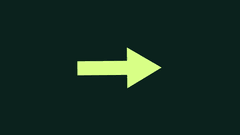
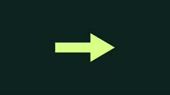
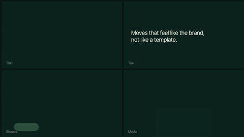
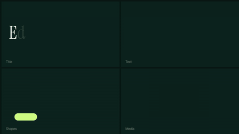
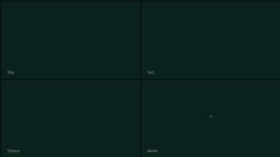
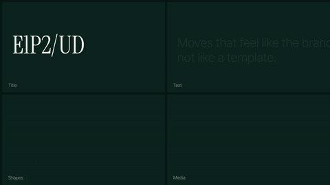

# Motion DNA · catalog

Every preset with its live thumbnail, energy and use, generated from `library/library.json`, `library/recipes.json` and
`library/packs.json` by `python tools/readme_catalog.py`. Filterable version: open `library/index.html`; for LLMs:
`library/INDEX.txt`. Tags (roles, targets, energy 1–5, tones) for every entry: `library/tags.json`.

<!-- catalog:start -->
**79 presets** in 5 categories, plus style packs. Every one is also listed in `library/INDEX.txt` (for LLMs) and `library/index.html` (for people).

### Motion (31)

Entrances and exits for any layer. `SSP.apply(layer, name, "in" | "out" | "both")`

|   |   |   |   |
|---|---|---|---|
|  **Fade** · `soft` Corporate, UI, supporting text |  **Fade Up** · `soft` Headlines, paragraphs, lists |  **Scale Pop** · `dynamic` Icons, chips, stickers, social |  **Blur In** · `soft` Photos, backgrounds, premium moments |
|  **Slide Land** · `medium` Images and cards entering from off-screen |  **Rotate Settle** · `medium` Logos, badges, pieces with personality |  **Squash Warp** · `dynamic` Social, hype, rhythmic transitions |  **Wipe Reveal** · `medium` Bars, lower thirds, underlines |
|  **Organic Draw** · `medium` Hand-drawn feel: contours, underlines, sketch lines (shape layers only) |  **Organic Stroke** · `dynamic` Traveling brush stroke: the start chases the end (accent lines, HUD links) |  **Line Draw** · `medium` Lines, stroke icons, tracking HUD (shape layers only) |  **Slam In** · `dynamic` Hero words, titles over footage, kinetic type |
|  **Flip In** · `medium` Cards, tiles, reveals, before/after |  **Spin Pop** · `dynamic` Badges, stickers, stamps, icons |  **Drop Bounce** · `dynamic` Icons, products, emoji, playful drops |  **Stretch Slide** · `dynamic` Cards, chips, pills, fast UI moves |
|  **Ramp Slide** · `dynamic` Transitions, product slides, bold entrances |  **Ramp Zoom** · `dynamic` Logo reveals, hero products, end cards |  **Ramp Spin** · `dynamic` Icons, badges, logo spins |  **Whip Pan** · `dynamic` Swipe transitions, camera-style moves, carousels |
|  **Surge Rise** · `medium` Headlines, cards, elegant entrances |  **Speed Ramp** · `dynamic` Footage, product shots, action beats, transitions |  **Punch Zoom** · `medium` Footage, precomps, freeze frames, cut emphasis |  **Coast Rise** · `soft` Product UI, editorial headlines, icons: fast start, clean stop |
|  **Wind-up Slide** · `soft` Logo slides, premium reveals: a small pull-back, then a long glide |  **Nudge Grow** · `soft` Bars, charts, columns, panels growing from their anchor (put the anchor at the base) |  **Snap Scale** · `medium` Editorial cuts on the action: shapes and type that jump in size and settle |  **Iris Reveal** · `medium` Scene changes, photo reveals, opening a new section from a point |
|  **Wordmark Reveal** · `medium` Wordmarks sliding out from behind their logo mark, names after an icon |  **Push Through** · `medium` Fly-through transitions: the camera pushes into a word, a logo or a planet and through it |  **Color Wipe** · `medium` Section changes: a full-frame color solid sweeps in diagonally (put it on a solid) |   |

### Classics (17)

Effects adapted from animate.css 4.1.1 (MIT) into native keyframes: entrances, exits and attention moves. Same call as Motion.

|   |   |   |   |
|---|---|---|---|
|  **Back In Down** · `dynamic` Cards, product shots, bold drops (enter) |  **Back In Left** · `dynamic` Slides, lower thirds, carousels (enter) |  **Bounce In** · `dynamic` Icons, badges, buttons, emoji (enter) |  **Bounce In Up** · `dynamic` Notifications, stickers, playful entrances (enter) |
|  **Rubber Band** · `dynamic` CTAs, logos, a beat accent (attention) |  **Jello** · `dynamic` Playful accents, stickers (attention) |  **Heart Beat** · `medium` Likes, prices, a pulse on the beat (attention) |  **Tada** · `dynamic` Reveals, wins, offers (attention) |
|  **Wobble** · `dynamic` Errors, jokes, quirky accents (attention) |  **Swing Hinge** · `medium` Signs, tags, hanging elements (attention) |  **Flip In X** · `medium` Cards, tiles, scoreboard flips (enter) |  **Light Speed In** · `dynamic` Speed, sport, fast lower thirds (enter) |
|  **Roll In** · `dynamic` Wheels, coins, round icons (enter) |  **Zoom In Down** · `medium` Titles that drop in from above (enter) |  **Jack In The Box** · `dynamic` Surprises, reveals, kids and playful brands (enter) |  **Back Out Up** · `dynamic` Exits upward, cards leaving (exit) |
|  **Zoom Out** · `soft` Quiet exits, scene changes (exit) |   |   |   |

### Text (11)

Per character or per word, on text layers. `SSP.applyText(layer, name, "in" | "out" | "both")`

|   |   |   |   |
|---|---|---|---|
|  **Chars Rise** · `medium` Short headlines, names, kickers |  **Words Fade Up** · `soft` Phrases, captions, quotes |  **Blur Words** · `soft` Premium moments, calm intros |  **Tracking Settle** · `medium` All-caps titles, typographic logos |
|  **Chars Pop** · `dynamic` Social, hype, big numbers |  **Typewriter** · `medium` Captions, terminals, UI, quotes |  **Scramble** · `dynamic` Tech, data, HUD labels, reveals |  **Count Up** · `medium` Stats, KPIs, prices, counters |
|  **Chars Ramp** · `medium` Titles that build tension, trailers, reveals |  **Words Slam** · `dynamic` Punchy statements, social hooks, VO beats |  **Chars Blur** · `soft` Opening titles, premium intros: characters resolve from blur one after another |   |

### Effects (11)

Continuous loops driven by expressions. `SSP.applyFx(layer, name)`

|   |   |   |   |
|---|---|---|---|
|  **Float** · `soft` Idle icons and cards, living backgrounds |  **Wiggle Rotate** · `medium` Stickers, illustrations with personality |  **Pulse** · `medium` CTAs, buttons, attention grabbers |  **Jitter** · `dynamic` Social, glitch, high-energy pieces |
|  **Breathe** · `soft` Ambient glows, background shapes, calm idle states |  **Swing** · `soft` Hanging tags, badges, signs, pendulums |  **Orbit** · `soft` Dots and satellites around a logo, decorative loops |  **Shake** · `dynamic` Impacts, bass hits, alarms, energetic footage |
|  **Holo Flicker** · `medium` HUD labels, tech overlays, holographic UI |  **Boil** · `medium` Collage, cut-outs, paper and texture layers: a subtle hand-made boil |  **On Twos** · `medium` Stop-motion feel: plays the layer's existing animation on 2s or 3s (apply after a motion preset) |   |

### Recipes (9)

Behavior measured from reference animations and rebuilt with our own keyframes. `SSP.applyRecipe(layer, id, "both")`

|   |   |   |   |
|---|---|---|---|
|  **W3L** · `dynamic` position & rotation & scale · loop |  **4LC** · `dynamic` position & rotation · transition |  **D2T** · `dynamic` position · loop |  **2JK** · `medium` rotation · loop |
|  **1DF+UNU** · `dynamic` scale · loop |  **X9R** · `medium` opacity & scale · transition |  **PE6** · `medium` position · transition |  **4VW** · `dynamic` position & scale · transition |
|  **2JV** · `dynamic` scale · transition |   |   |   |

### Packs (9)

One click gives a whole comp an identity: each layer gets the preset of its role (title, subtitle, body, shape, media, logo), staggered. `SSP.applyPack(comp, name)`

|   |   |   |   |
|---|---|---|---|
|  **Dynamic** · `dynamic` Social, launches, hype: fast slams, whips and speed ramps. |  **Elegant** · `soft` Premium, fashion, hospitality: slow blurs, soft rises, generous timing. |  **Modern** · `medium` Corporate, SaaS, product: clean rises and slides on the brand curves. |  **Playful** · `dynamic` Kids, food, consumer apps: bounces, wobbles and jack-in-the-box reveals. |
|  **Tech** · `medium` Data, AI, fintech, HUDs: decoding text, line draws and holographic flicker. |  **Calm Modern** · `soft` Product and brand pieces: small travel, word-by-word text, quiet exits, no bounce. |  **Editorial** · `medium` Brand systems, tech launches, type-led films: typing, snaps on the action, construction lines, clean ease-outs (Motion Style Map: Editorial). |  **Storybook** · `soft` Warm product launches and character explainers: line-by-line rises, soft 3% overshoots, circular reveals (Motion Style Map: Warm editorial, Character). |
|  **Collage** · `dynamic` Mixed media, cut-outs, archive and texture: whips through layers, hand-made boil on 3s, decoding type (Motion Style Map: Mixed media). |   |   |   |
<!-- catalog:end -->
