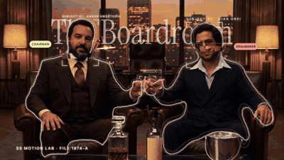
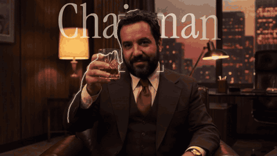
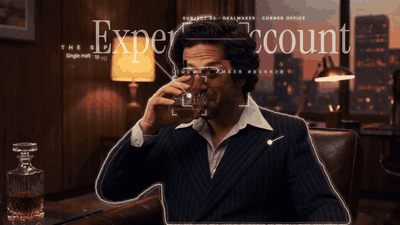
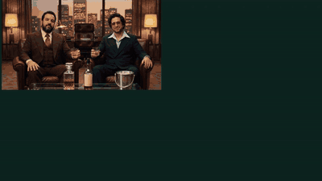

# Case study: *The 1974 Boardroom*

A 36 s capability test of the whole pipeline: AI footage → tracking → roto → HUD built from library presets → edit with music and SFX → breakdown. Final video: [`docs/examples/whisky_1974_boardroom.mp4`](../examples/whisky_1974_boardroom.mp4).

| Shot 1 | Shot 2 | Shot 3 | Breakdown |
|---|---|---|---|
|  |  |  |  |

## Brief
Two project collaborators as classy 1970s executives drinking whisky and looking at camera. Lines reveal descriptions of the outfit, the liquor and its cost, a "build scan" of each character and holographic character info — all tracked, using the SS Motion library and the *Essentials* Figma graphics. Three consistent clips, music, text behind the people, and a roto/mask breakdown.

## Steps (reproducible)
| # | Step | Tool / file |
|---|---|---|
| 1 | Identity photos uploaded to Flora | `flora_create_asset(signed-url)` + `tools/signed_upload.py` |
| 2 | Master two-shot (both identities) | Nano Banana Pro `is2i-gemini-3-pro`, 16:9 2K → `media/whisky/shot01_master.jpg` |
| 3 | Close-ups using `[master, identity]` as references | same model → `shot02_aaron.jpg`, `shot03_gian.jpg` |
| 4 | Three 5 s clips | Kling 3.0 Pro `i2v-kling-v3-pro` → normalize to 1920×1080 @ 24 fps → `clip01..03.mp4` |
| 5 | Tracking (6–10 regions per clip) | `tools/track_points.py --regions media/whisky/clipNN_regions.json` → `clipNN_tracks.json` |
| 6 | Person mattes | VEED `v2v-veed-bg-removal` on the uploaded 1080p clips → `clipNN_matte.webm` → ProRes 4444 `.mov` |
| 7 | Contours | `tools/matte_contours.py` (`--subjects 2 --split-x 960` for the two-shot) → `clipNN_contours.json` |
| 8 | Scenes | `media/whisky/scenes.json` → `bash tools/bridge.sh tools/build_scene.jsx` |
| 9 | Breakdown 2×2 | `scenes.json → breakdown` → `bash tools/bridge.sh tools/build_breakdown.jsx` |
| 10 | Music | ElevenLabs Music `t2a-elevenlabs-music-t2a` → `music_70s_funk_26s.mp3` |
| 11 | Edit (cuts on the beat, SFX, end card) | `media/whisky/edit.json` → `bash tools/bridge.sh tools/build_edit.jsx` |
| 12 | Voiceover (6 lines) | ElevenLabs v3 `t2a-elevenlabs-tts-v3`, voice Adam, stability 0.35 → trimmed, loudnorm, `atempo=1.07` → `media/whisky/vo/vo01..06.wav` |
| 13 | Freeze frames + VO + ducking | `edit.json` → `freeze` per shot, `vo` in shot-local time → `build_edit.jsx` |
| 14 | Render + QA | `tools/render_comps.jsx` + `tools/wait_files.sh`, contact sheets, loudness −16.2 LUFS |

## What each shot shows
- **Shot 1 (two-shot):** behind-the-subject title "The Boardroom" tracked to the skyline; organic contour lines (spark / coral); face-scan slices; scan brackets with name cards; role chips; liquor brackets on both glasses + "LIQUOR SCAN" callout; "THE SPIRIT" bottle callout (fades out before the bottle leaves frame); deal-confidence meter.
- **Shot 2 (subject 01):** "Chairman" behind him; contour; face scan; liquor bracket on the glass as it rises to the mouth; outfit, pour and build-scan callouts; style index.
- **Shot 3 (subject 02):** "Dealmaker" behind him; contour; face scan; liquor bracket on the glass (fades out when the glass leaves frame); outfit and bar-service callouts; charisma meter.
- **Breakdown:** 01 Plate (Flora + Kling) · 02 Roto matte (VEED) · 03 Contours (OpenCV) · 04 Composite (SS Motion).

## Voiceover script (70s announcer, deadpan)
| When | Line | Freeze title |
|---|---|---|
| Shot 1 opens | "Nineteen seventy-four. The corner office." | — |
| Shot 1 freeze | "Two executives. One decanter. Zero emails." | **Zero emails.** · 2 EXECUTIVES · 1 DECANTER · 0 MEETINGS |
| Shot 2 freeze | "The Chairman. Three-piece suit. The smirk? *(chuckles)* Complimentary." | **The Chairman.** · SMIRK INCLUDED · NO EXTRA CHARGE |
| Shot 3 freeze | "The Dealmaker. Aviators. Indoors. At night. … Bold." | **The Dealmaker.** · AVIATORS · INDOORS · AT NIGHT |
| Breakdown | "Every pixel? Rotoscoped by robots. *(chuckles)* The robots now want a corner office." | — |
| End card | "The 1974 Boardroom. Superside Motion Lab." | — |

## Prompts used
**Master still (Nano Banana Pro, images: identity A, identity B)**
> Photorealistic 1970s 35mm film still. Keep both men's faces and identities exactly as in the reference photos… Two powerful 1970s business executives sit side by side in deep oxblood leather club chairs in a high-rise executive office at dusk: walnut wood paneling, a big window with a warm city skyline, a glass coffee table with a crystal whisky decanter, a whisky bottle with a blank cream label, and an ice bucket. Both hold heavy cut-crystal tumblers with amber whisky and look straight into the camera with confident, classy half-smiles. Man 1 wears a chocolate-brown three-piece suit… Man 2 wears a navy pinstripe double-breasted suit… Warm tungsten practical lights, soft haze, rich film grain, slight halation, Kodak 5247 look, medium-wide two-shot… No text, no logos.

**Close-ups (images: master, identity)**
> Same scene, same lighting, same wardrobe and same 1970s 35mm film look as image 1. New shot: medium close-up of [subject] … raising his cut-crystal whisky tumbler slightly toward the camera in a confident toast, looking straight into the lens… No text, no logos.

**Video (Kling 3.0 Pro, 5 s, 1080p)**
> 1970s 35mm film footage. Slow, smooth handheld push-in… Both men keep looking straight into the camera… they raise their crystal whisky tumblers toward the camera in a subtle toast… Keep both faces and identities consistent. No cuts, no text.

**Music (ElevenLabs Music)**
> Instrumental 1970s soul-funk lounge track, 26 seconds… tight funk drums with brushed hi-hats, warm Fender Rhodes chords, round bass groove, wah guitar licks, a muted trumpet and saxophone hook. 96 BPM… around second 15 a short breakdown with only Rhodes, bass and a ticking hi-hat for 5 seconds, then the full band returns… clean ending on the last bar. No vocals.

## Issues found and fixed (see `docs/LEARNINGS.md`)
- Kicker/meter overlapping name cards after the push-in → moved to empty bottom corners.
- Contours merged during the toast → `--split-x`.
- Face-scan edges turned into a green blob → Threshold before Tint.
- Giant words fighting the HUD → 68% opacity.
- VEED failed on the raw Kling URL → upload the normalized 1080p clip.
- `aerender` hang with Animation Composer layers → render through the AE queue.
- Freeze frames only worked on shot 1 → `setValueAtTime` uses comp time; offset remap keys by the shot start.
- Contours drew at constant speed → `Organic Draw` (uneven keyframe spacing).

All prices, bottlings and roles are fictional. Subjects are project collaborators who agreed to appear in tests.
