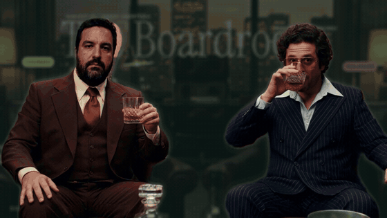
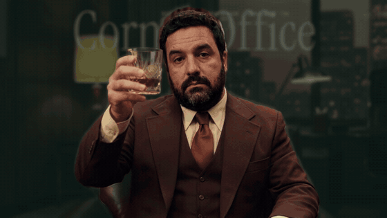
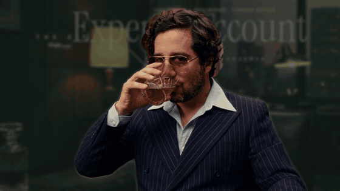
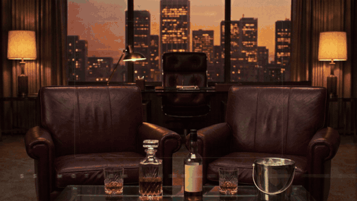

# Case study: *The 1974 Boardroom*

A 45 s capability test of the whole pipeline, made to present the library to the team: AI footage → tracking → roto → HUD built from library presets → freeze frames with kinetic type → roto breakdown → the library app in the empty office → end card. Final video: [`docs/examples/whisky_1974_boardroom.mp4`](../examples/whisky_1974_boardroom.mp4).

| "Zero keyframes." | "Tracked." | "Rotoscoped." | Library app | Breakdown |
|---|---|---|---|---|
|  |  |  |  |  |

## Brief
Two project collaborators as classy 1970s executives drinking whisky and looking at camera. Lines reveal descriptions of the outfit, the liquor and its cost, a "build scan" of each character and holographic character info — all tracked, using the Motion DNA library and the *Essentials* Figma graphics. Three consistent clips, music, text behind the people, and a roto/mask breakdown.

## Steps (reproducible)
| # | Step | Tool / file |
|---|---|---|
| 1 | Identity photos uploaded to Flora | `flora_create_asset(signed-url)` + `tools/signed_upload.py` |
| 2 | Master two-shot (both identities) | Nano Banana Pro `is2i-gemini-3-pro`, 16:9 2K → `media/whisky/shot01_master.jpg` |
| 3 | Close-ups using `[master, identity]` as references | same model → `shot02_aaron.jpg`, `shot03_gian.jpg` |
| 4 | Three 5 s clips | Kling 3.0 Pro `i2v-kling-v3-pro` → normalize to 1920×1080 @ 24 fps → `clip01..03.mp4` |
| 5 | Tracking (6–10 regions per clip) | `tools/track_points.py --regions media/whisky/clipNN_regions.json` → `clipNN_tracks.json` |
| 6 | Person mattes | VEED `v2v-veed-bg-removal` on the uploaded 1080p clips → `clipNN_matte.webm` → ProRes 4444 `.mov` |
| 7 | Contours | `tools/matte_contours.py` (`--subjects 2 --split-x 960` for the two-shot) → `clipNN_contours.json` |
| 8 | Scenes | `media/whisky/scenes.json` → `bash tools/bridge.sh tools/build_scene.jsx` |
| 9 | Breakdown 2×2 | `scenes.json → breakdown` → `bash tools/bridge.sh tools/build_breakdown.jsx` |
| 10 | Music | ElevenLabs Music `t2a-elevenlabs-music-t2a` → `music_70s_funk_46s.mp3` (46 s version for the final cut) |
| 11 | Edit (cuts on the beat, SFX, end card) | `media/whisky/edit.json` → `bash tools/bridge.sh tools/build_edit.jsx` |
| 12 | Voiceover (6 lines) | ElevenLabs v3 `t2a-elevenlabs-tts-v3`, voice Adam, **stability 0.15** + tone tags → trimmed, loudnorm → `media/whisky/vo/v4_01..06.wav` |
| 13 | Library app screen | Visualizer screenshots per filter (`msedge --headless --screenshot "library/index.html?poster=1&kind=<kind>"`) → `tools/build_app_screen.jsx` (browser window, cursor clicks each filter) → `panel` item in `WHISKY_LIBRARY` |
| 14 | Freeze frames + kinetic type + VO + ducking | `edit.json` → `freeze` per shot (`beats`, `title`, `sub`, clean `plate` for the cut-out) → `build_edit.jsx` |
| 15 | Render + QA | `tools/render_comps.jsx` + `tools/wait_files.sh`, contact sheets, loudness −16 LUFS |

## What each shot shows
- **Shot 1 (two-shot):** behind-the-subject title "The Boardroom" tracked to the skyline; organic contour lines (spark / coral); face-scan slices; scan brackets with name cards; role chips; liquor brackets on both glasses + "LIQUOR SCAN" callout; "THE SPIRIT" bottle callout (fades out before the bottle leaves frame); deal-confidence meter.
- **Shot 2 (subject 01):** "Chairman" behind him; contour; face scan; liquor bracket on the glass as it rises to the mouth; outfit, pour and build-scan callouts; style index.
- **Shot 3 (subject 02):** "Dealmaker" behind him; contour; face scan; liquor bracket on the glass (fades out when the glass leaves frame); outfit and bar-service callouts; charisma meter.
- **Breakdown:** 01 Plate (Flora + Kling) · 02 Roto matte (VEED) · 03 Contours (OpenCV) · 04 Composite (Motion DNA).

## Voiceover script (70s announcer, expressive)
| When | Line (tone tags in brackets) | On screen |
|---|---|---|
| Shot 1 opens | "[theatrical, big warm smile] Nineteen seventy-four. Two executives… [beat] and a brand-new motion library." | — |
| Shot 1 freeze | "[building excitement] Every line. Every label. Every glass. [proud, punchy] Zero keyframes set by hand!" | EVERY **LINE.** · EVERY **LABEL.** · EVERY **GLASS.** · Zero **keyframes.** |
| Shot 2 freeze | "[impressed and playful] The Chairman. Tracked, scanned… [chuckles] and annotated before his first sip." | **Tracked.** · SCANNED. · ANNOTATED. |
| Shot 3 freeze | "[sly and amused] The Dealmaker. Rotoscoped by robots. [laughs] The aviators… were his idea." | **Rotoscoped.** · BY ROBOTS |
| Breakdown | "[confident and fast-paced] Plate. Matte. Contours. Composite. [slower, proud] One library… every shot." | 01 Plate · 02 Roto matte · 03 Contours · 04 Composite |
| Library + end card | "[grand finale, warm] S S Motion. Superside's motion library. [chuckles] Now with whisky." | The library app · Motion DNA · by Aaron Amortegui & Gian Orsi |

**Freeze typography:** each line lands big and centered (scale overshoot + blur + slight tilt, swoosh SFX), with contrasting sizes (small tracked caps lead + huge serif hero). Lines replace each other instead of stacking; beats after the title cycle in the title's lead slot. The background darkens and defocuses; the people are cut from the clean plate so HUD lines don't run under the type.

## Prompts used
**Master still (Nano Banana Pro, images: identity A, identity B)**
> Photorealistic 1970s 35mm film still. Keep both men's faces and identities exactly as in the reference photos… Two powerful 1970s business executives sit side by side in deep oxblood leather club chairs in a high-rise executive office at dusk: walnut wood paneling, a big window with a warm city skyline, a glass coffee table with a crystal whisky decanter, a whisky bottle with a blank cream label, and an ice bucket. Both hold heavy cut-crystal tumblers with amber whisky and look straight into the camera with confident, classy half-smiles. Man 1 wears a chocolate-brown three-piece suit… Man 2 wears a navy pinstripe double-breasted suit… Warm tungsten practical lights, soft haze, rich film grain, slight halation, Kodak 5247 look, medium-wide two-shot… No text, no logos.

**Close-ups (images: master, identity)**
> Same scene, same lighting, same wardrobe and same 1970s 35mm film look as image 1. New shot: medium close-up of [subject] … raising his cut-crystal whisky tumbler slightly toward the camera in a confident toast, looking straight into the lens… No text, no logos.

**Video (Kling 3.0 Pro, 5 s, 1080p)**
> 1970s 35mm film footage. Slow, smooth handheld push-in… Both men keep looking straight into the camera… they raise their crystal whisky tumblers toward the camera in a subtle toast… Keep both faces and identities consistent. No cuts, no text.

**Music (ElevenLabs Music)**
> Instrumental 1970s soul-funk lounge track, 26 seconds… tight funk drums with brushed hi-hats, warm Fender Rhodes chords, round bass groove, wah guitar licks, a muted trumpet and saxophone hook. 96 BPM… around second 15 a short breakdown with only Rhodes, bass and a ticking hi-hat for 5 seconds, then the full band returns… clean ending on the last bar. No vocals.

## Issues found and fixed (see `docs/LEARNINGS.md`)
- Kicker/meter overlapping name cards after the push-in → moved to empty bottom corners.
- Contours merged during the toast → `--split-x`.
- Face-scan edges turned into a green blob → Threshold before Tint.
- Giant words fighting the HUD → 68% opacity.
- VEED failed on the raw Kling URL → upload the normalized 1080p clip.
- `aerender` hang with Animation Composer layers → render through the AE queue.
- Freeze frames only worked on shot 1 → `setValueAtTime` uses comp time; offset remap keys by the shot start.
- Contours drew at constant speed → `Organic Draw` (uneven keyframe spacing).
- People darkened during freezes → matte cut-out above the scrim.
- Flat VO → stability 0.15 + tone tags; harsh beep → soft blips.
- Kicker lines stacked and overlapped → one centered line at a time with contrasting sizes.
- Breakdown composite cell went empty after rebuilding scenes → `build_scene.jsx` rebuilds the breakdown.
- Basic preview panels in the office → a real screenshot of the library app with a cursor clicking each category.

All prices, bottlings and roles are fictional. Subjects are project collaborators who agreed to appear in tests.
